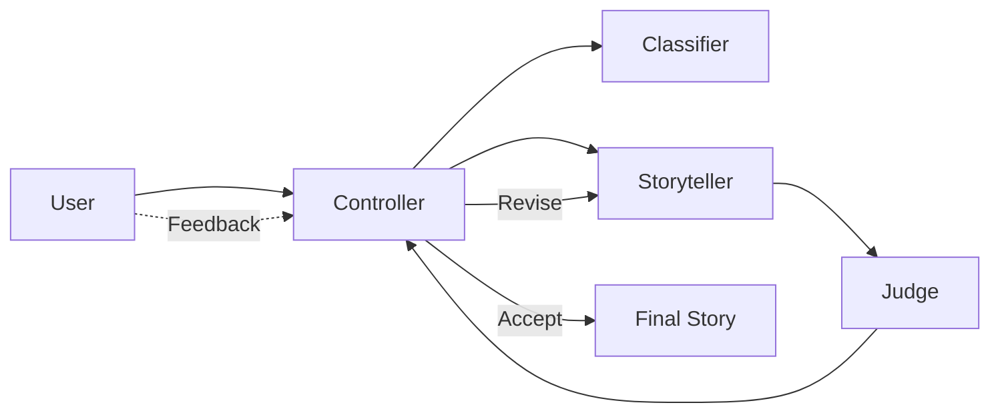

# Hippocratic AI Bedtime Storyteller

## Overview
This project implements a controlled bedtime story system for ages 5–10 using a Storyteller/Judge/Controller loop with request classification and optional interactive feedback. The model is fixed to `gpt-3.5-turbo`, and safety/quality are enforced via prompts and structured judge output.

## Rationale
The system constrains behavior through explicit prompts and deterministic controller decisions instead of model changes. A judge evaluates the story against a strict JSON rubric to support revisions and safe fallbacks, while a lightweight classifier selects category-specific prompt guidance.

## Run Instructions
1) Create a local `.env` with your `OPENAI_API_KEY`.
2) Install dependencies:

```bash
pip install -r requirements.txt
```

3) Run the CLI:

```bash
python main.py
```

Optional flags:
- `--interactive`: accept follow-up feedback and revise the story (enabled by default)
- `--verbose`: log stage transitions, judge summary, and stop reason

## Categories
The classifier routes requests into one of these categories:
- `gentle_bedtime` (default)
- `comfort`
- `adventure`
- `humor`
- `educational`

## Environment Variables
- `OPENAI_API_KEY`: OpenAI API key (required)
- `MAX_ROUNDS`: Max revision rounds (default 3)
- `QUALITY_THRESHOLD`: Accept threshold for average score (default 4.0)
- `MAX_TOKENS_STORY`: Max tokens for storyteller (default 2000)
- `MAX_TOKENS_JUDGE`: Max tokens for judge (default 1000)
- `TEMPERATURE_STORY`: Story temperature (default 0.6)
- `TEMPERATURE_JUDGE`: Judge temperature (default 0.0)

## System Block Diagram
See `diagrams/system_block_diagram.mmd` or rendered below:



## Judge Rubric Summary
The judge returns JSON with:
- `age_appropriate` (bool)
- `safe` (bool)
- `reason_age` (str)
- `reason_safety` (str)
- `coherence` (int 1–5)
- `story_arc` (int 1–5)
- `language_simplicity` (int 1–5)
- `suggestions` (list of 1–3 actionable items)

## Trade-offs and Limitations
- Prompting and judging provide control but are not foolproof.
- The judge output can be inconsistent; robust parsing is required.
- Classification adds an extra LLM call per session.
- No persistent memory or personalization beyond the current session.

## Examples
See the `examples/` directory for seven curated prompts and expected behaviors.

## What I’d Do With 2 More Hours
- Multi-pass blueprinting: generate 2–3 blueprints, score them with the judge, and pick the best before writing the story.
- Dynamic safety filters: add lightweight rule checks on output (e.g., regex for disallowed terms) before judge scoring.
- Diversity fallback pool: store multiple safe fallback stories and randomize selection to avoid repetition.
- Structured logging + tracing: emit standardized traces for classifier/judge/storyteller to enable dashboards and regression analysis.
